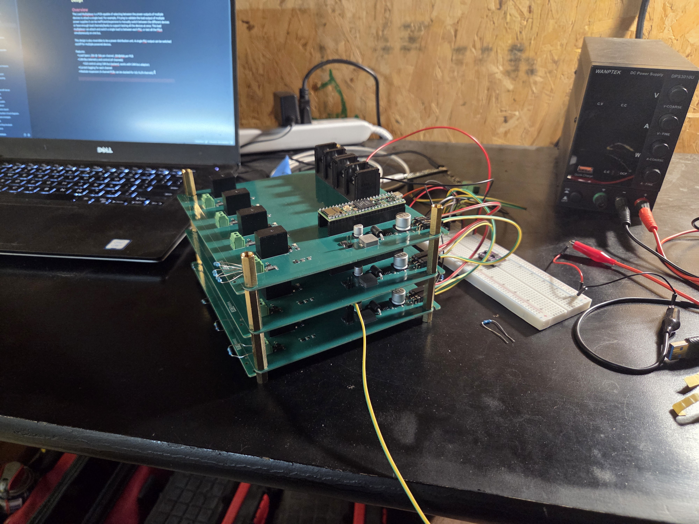
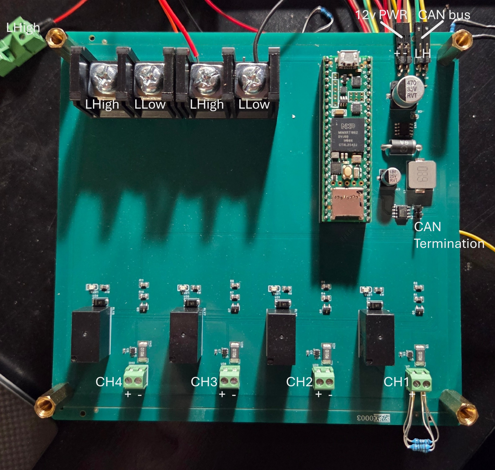
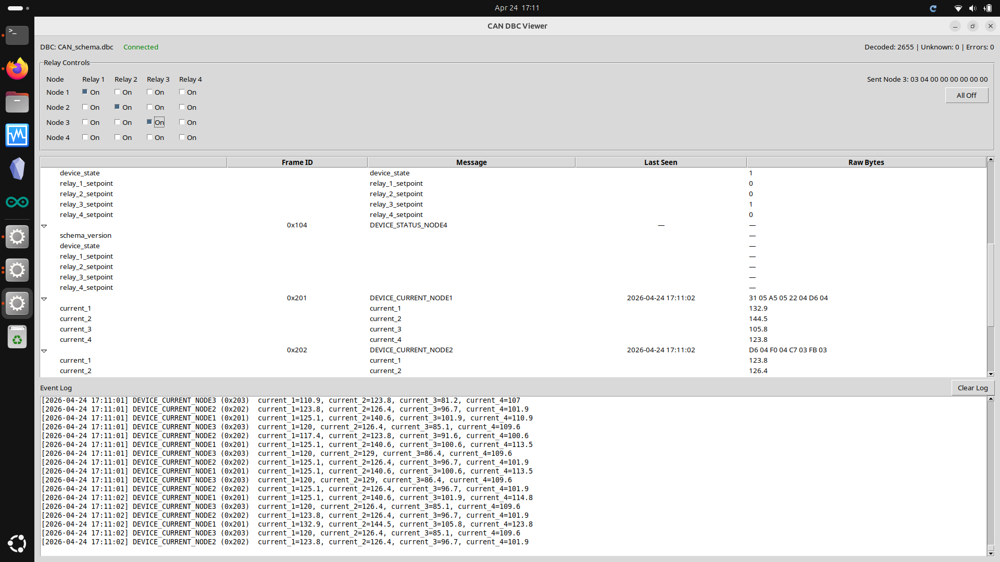

# Overview
The Load Multiplexor is a PCB capable of selecting between the power outputs of multiple devices to attach a single load. For example, if trying to validate the load output of multiple power supplies it can be inefficient/expensive to manually switch between the different devices or have enough load channels/banks to support testing all the devices at once. This load multiplexor can attach and switch a single load to between each PSU, or test all the PSUs simultaneously on one bus.

This design is also reversible to be a power distribution unit. A single PSU output can be switched on/off for multiple powered devices.

**Features:**
- Load Specs: 28V @ 10A per channel, 28V@40A per PCB
- CAN Bus telemetry and control (of channels)
	- GUI control using CAN bus backend, works with CAN bus adapters
- Current logging for each channel
- Modular expansion (4 channel PCBs can be stacked for 4,8,16,20 channels)

# Setup
**Configure CAN Adapter**
- Plug CAN adapter into computer, configure for 500 kb/s data speed (on Linux, example): `sudo ip link set can0 up type can bitrate 500000`

**Configure MCU**
- Load Arduino
- Install Teensy 4.1 board manager
- Install Libraries: FlexCAN_T4
- Plug teensy 4.1 into computer through USB
- Flash `pdu_node_control_loop.ino` to board
	- First, edit `Config.h` to set `NODEID` to 1,2,3, or 4 (if using multiple boards)
- Disconnect board

**Connect/Power On**
- Connect 12v PSU to 12v PWR bus
- Connect CANH/CANL lines of CAN adapter to CAN Bus
	- Ensure there are 2 120 Ohm terminations on either end of bus (most CAN adapters have one, so add one 120 Ohm termination to the board terminations).
- Connect Load or PSU to corresponding LHigh/LLow terminals
- Connect devices to corresponding CH +/- terminals
- Program Teensy with device code
- Plug Teensy into teensy slot
	- Ensure USB is disconnected
- Power on system with 12V 0.5A current limit

**GUI Control**
- Install python/modules in requirements.txt
- Navigate to pc_controller directory
- Basic run: `python pc_controller_dbc.py.py --dbc CAN_schema.dbc --channel can0 --bustype socketcan --bitrate 500000`

# ICD
**Electrical**
- 12V power bus, powers MCUs and Relays, draws <1A current
- CAN bus, standard CAN interface
- Load/PSU mains (LHigh/LLow), mains to attach central PSU or load bank
- oad/PSU channels, channels to attach devices

**CAN Telemetry Schema**
See `CAN_schema.dbc` for more details on full CAN ICD
Msgs:
- `CONTROLLER_CMD`, don't exceed 40 Hz (based on RelayCtrlTask)
- `DEVICE_STATUS`, ~1 Hz
- `DEVICE_CURRENT`, ~ 10 Hz

# GUI
Supports relay control and display of device telemetry (up to 4 modules).

# Future Design Upgrades
**Label PCB**
- [ ] Update CAN transceiver to work with teensy 3.3v power and logic levels.
- [ ] Label CANH and CANL
- [ ] Label LHIGH and LRTN
- [ ] Label 12V and RTN

**Fix Current Measurement**
- [ ] Fix current measurement so it gives actual values

**misc**
- [ ] Add relay state verification measurement path (discrete measurement?)
- [ ] Add a dedicated high load path (was using fill, but this ends up inadvertently cutting off return path as traces are added to the fill, so it's better just to define a path which meets spec)
- [ ] Move DCDC converter to make room for CAN transceiver
- [ ] Add high pass filter to analog voltage measurements
- [ ] Use connectors for 12v and CAN
- [ ] Use one power terminal
- [ ] Test points - stuff that isn't easily reachable with everything installed. potentially teensy pins? 5v output check?
